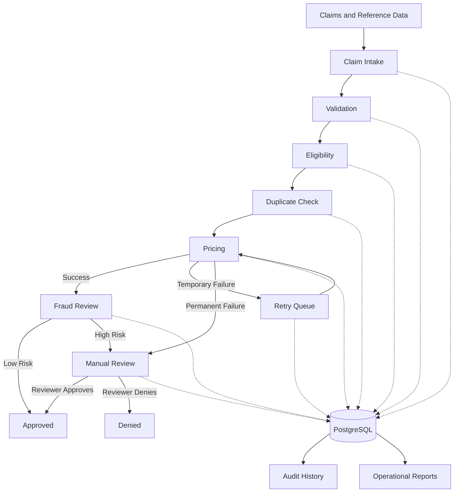

# Healthcare Claims Workflow

A stateful healthcare claims-processing simulation built with Python and PostgreSQL.

The system processes synthetic claims through validation, eligibility, duplicate detection, pricing, fraud and business-rule review, bounded retries, manual review, approval, audit history, automated testing, controlled-chaos verification, and operational reporting.

> All records, rules, decisions, amounts, identifiers, and scenarios in this repository are synthetic. The project contains no protected health information, proprietary adjudication logic, or production healthcare data.

---

## Project Overview

The Healthcare Claims Workflow demonstrates how an operational process can be modeled as an explicit state machine rather than a collection of disconnected scripts.

A successful claim moves through the complete automated path:

```text
RECEIVED
    ↓
VALIDATING
    ↓
ELIGIBILITY_CHECK
    ↓
DUPLICATE_CHECK
    ↓
PRICING
    ↓
FRAUD_REVIEW
    ↓
APPROVED
```

Claims that cannot continue automatically receive controlled outcomes such as:

```text
VALIDATION_FAILED
DENIED
DUPLICATE
PRICING_RETRY
MANUAL_REVIEW
FAILED
```

The workflow can answer four operational questions:

```text
Where is the claim now?
Where has the claim been?
Why did its status change?
When did the change occur?
```

---

## Business Problem

Claims-processing systems rarely follow only a clean happy path.

Operational workflows must handle:

- Missing required information
- Invalid reference codes
- Inactive members
- Expired coverage
- Duplicate submissions
- Missing pricing configuration
- Temporary pricing timeouts
- Retry exhaustion
- High-risk claims
- Manual reviewer decisions
- Unexpected technical failures

Without controlled states, queues, and audit history, claims can become stuck, silently fail, repeat processing, or lose the explanation behind a decision.

This project addresses that problem by ensuring:

1. Every claim has one current state.
2. Only approved state transitions are allowed.
3. Every transition is recorded.
4. Temporary failures can be retried.
5. Permanent failures can be routed to manual review.
6. Reviewer decisions produce final outcomes.
7. One unexpected claim failure does not stop the remaining batch.
8. Reports summarize workflow activity and operational exceptions.

---

## Architecture



A simplified text representation:

```text
                Claims
                    |
                    v
              Claim Intake
                    |
                    v
               Validation
                    |
                    v
               Eligibility
                    |
                    v
            Duplicate Check
                    |
                    v
                 Pricing
                 /     \
                /       \
          Success      Timeout
             |            |
             |       Retry Queue
             |            |
             |<-----------+
             v
          Fraud Review
           /       \
          /         \
     Low Risk     High Risk
        |             |
        |       Manual Review
        |          /     \
        |     Approve    Deny
        |        |         |
        +--------+---------+
                 |
                 v
              Reporting
```

---

## Technology Stack

| Technology | Purpose |
|---|---|
| Python 3.11+ | Workflow and business logic |
| PostgreSQL | Claims, queues, state, and audit history |
| Psycopg 3 | PostgreSQL connectivity |
| python-dotenv | Local environment configuration |
| Pytest | Automated testing |
| CSV | Claims, members, and diagnosis reference data |
| JSON | Pricing rules, review rules, decisions, and scenario expectations |
| Git and GitHub | Version control and portfolio publishing |

Python 3.11 or newer is required because the project uses `StrEnum`.

---

## Project Structure

```text
healthcare-claims-workflow/
│
├── data/
│   ├── chaos_scenarios.json
│   ├── claims.csv
│   ├── diagnosis_codes.csv
│   ├── manual_review_decisions.json
│   ├── members.csv
│   ├── pricing_rules.json
│   └── review_rules.json
│
├── database/
│   ├── schema.sql
│   └── seed_data.py
│
├── logs/
│   └── .gitkeep
│
├── reports/
│   ├── chaos_scenario_report.json
│   ├── claim_summary.csv
│   ├── claim_summary.json
│   ├── exception_report.json
│   ├── workflow_metrics.json
│   └── workflow_summary.json
│
├── src/
│   ├── audit_logger.py
│   ├── chaos_runner.py
│   ├── claim_loader.py
│   ├── config.py
│   ├── database.py
│   ├── duplicate_checker.py
│   ├── eligibility.py
│   ├── error_handler.py
│   ├── fraud_review.py
│   ├── main.py
│   ├── manual_review.py
│   ├── pricing.py
│   ├── reporting.py
│   ├── retry_manager.py
│   ├── state_manager.py
│   ├── validator.py
│   └── workflow_engine.py
│
├── tests/
│   ├── conftest.py
│   ├── test_duplicate_checker.py
│   ├── test_eligibility.py
│   ├── test_happy_path.py
│   ├── test_manual_review.py
│   ├── test_pricing.py
│   ├── test_retry_manager.py
│   ├── test_state_manager.py
│   ├── test_validation.py
│   └── test_workflow_resilience.py
│
├── .env
├── .env.example
├── .gitignore
├── pytest.ini
├── README.md
└── requirements.txt
```

The local `.env` and `.venv` files are excluded from Git.

---

## Workflow

The application runs in four phases.

### Phase 1 — Initial processing

```text
Claim Intake
    ↓
Validation
    ↓
Eligibility
    ↓
Duplicate Detection
    ↓
Pricing
    ↓
Fraud and Business-Rule Review
```

### Phase 2 — Retry processing

Temporary pricing failures enter `retry_queue`.

```text
PRICING
    ↓
PRICING_RETRY
    ↓
Retry Queue
    ↓
PRICING
```

A retry queue item can end in:

```text
SUCCEEDED
EXHAUSTED
CANCELLED
```

### Phase 3 — Manual review

Claims that cannot continue automatically enter `manual_review_queue`.

```text
PENDING
    ↓
IN_REVIEW
    ↓
APPROVED or DENIED
```

### Phase 4 — Controlled-chaos verification

The application compares persisted PostgreSQL results against the expectations in:

```text
data/chaos_scenarios.json
```

It verifies:

- Final claim status
- Required state path
- Audit reasons
- Retry status
- Retry count
- Manual-review status
- Required timestamps and processing steps

---

## Data Model

### `claims`

Stores the current state of every claim.

Important fields:

| Field | Description |
|---|---|
| `claim_id` | Unique synthetic claim identifier |
| `member_id` | Member associated with the claim |
| `provider_id` | Provider associated with the claim |
| `diagnosis_code` | Synthetic diagnosis reference |
| `procedure_code` | Synthetic procedure reference |
| `service_date` | Date of service |
| `billed_amount` | Submitted claim amount |
| `allowed_amount` | Amount assigned during pricing |
| `submitted_date` | Submission date |
| `current_status` | Current workflow state |
| `created_at` | Claim creation timestamp |
| `updated_at` | Last record update |

### `claim_events`

Stores the complete state-transition history.

| Field | Description |
|---|---|
| `event_id` | Unique event identifier |
| `claim_id` | Claim associated with the event |
| `previous_status` | State before the transition |
| `new_status` | State after the transition |
| `processing_step` | Workflow component responsible |
| `event_reason` | Explanation for the change |
| `retry_attempt` | Retry number when applicable |
| `created_at` | Transition timestamp |

### `retry_queue`

Stores temporary pricing failures.

| Field | Description |
|---|---|
| `retry_id` | Queue record identifier |
| `claim_id` | Claim waiting for retry |
| `failed_step` | Workflow step that failed |
| `retry_count` | Retry attempts completed |
| `max_retries` | Maximum automated attempts |
| `next_retry_time` | Time the item is available |
| `retry_status` | Queue outcome |
| `last_error` | Most recent error |

### `manual_review_queue`

Stores claims requiring human intervention.

| Field | Description |
|---|---|
| `review_id` | Review record identifier |
| `claim_id` | Claim requiring review |
| `review_reason` | Explanation for the handoff |
| `review_status` | Queue state or reviewer outcome |
| `reviewer_notes` | Synthetic reviewer explanation |
| `created_at` | Queue creation time |
| `resolved_at` | Review completion time |

---

## State Transitions

The workflow does not permit arbitrary state changes.

### Happy path

| Current state | Next state |
|---|---|
| `RECEIVED` | `VALIDATING` |
| `VALIDATING` | `ELIGIBILITY_CHECK` |
| `ELIGIBILITY_CHECK` | `DUPLICATE_CHECK` |
| `DUPLICATE_CHECK` | `PRICING` |
| `PRICING` | `FRAUD_REVIEW` |
| `FRAUD_REVIEW` | `APPROVED` |

### Exception paths

| Current state | Possible next state |
|---|---|
| `VALIDATING` | `VALIDATION_FAILED` |
| `ELIGIBILITY_CHECK` | `INELIGIBLE` |
| `INELIGIBLE` | `DENIED` |
| `DUPLICATE_CHECK` | `DUPLICATE` |
| `PRICING` | `PRICING_RETRY` |
| `PRICING` | `MANUAL_REVIEW` |
| `PRICING_RETRY` | `PRICING` |
| `PRICING_RETRY` | `MANUAL_REVIEW` |
| `FRAUD_REVIEW` | `MANUAL_REVIEW` |
| `MANUAL_REVIEW` | `APPROVED` |
| `MANUAL_REVIEW` | `DENIED` |

Examples of blocked transitions:

```text
VALIDATION_FAILED → PRICING
DUPLICATE → APPROVED
APPROVED → VALIDATING
DENIED → PRICING
```

The workflow validates transitions in Python and confirms that PostgreSQL contains the expected current status before applying the update.

---

## Exception Handling

Expected business exceptions receive controlled outcomes.

| Condition | Outcome |
|---|---|
| Missing required value | `VALIDATION_FAILED` |
| Invalid diagnosis | `VALIDATION_FAILED` |
| Unknown member | `INELIGIBLE → DENIED` |
| Inactive or expired coverage | `INELIGIBLE → DENIED` |
| Duplicate claim | `DUPLICATE` |
| Temporary pricing timeout | `PRICING_RETRY` |
| Missing pricing rule | `MANUAL_REVIEW` |
| High-risk rule | `MANUAL_REVIEW` |
| Retry exhaustion | `MANUAL_REVIEW` |
| Reviewer approval | `APPROVED` |
| Reviewer denial | `DENIED` |

Unexpected technical errors are isolated by claim.

```text
Claim A → APPROVED

Claim B → unexpected technical error
        → FAILED result
        → SYSTEM_ERROR audit attempt

Claim C → continues processing
```

A single failed claim does not stop the rest of the batch.

---

## Retry Logic

Pricing failures are classified as temporary or permanent.

### Temporary failure

A temporary failure may succeed later without changing business configuration.

```text
Pricing timeout
    ↓
PRICING_RETRY
    ↓
retry_queue
    ↓
Retry attempt
```

Retry records store:

- Failed step
- Retry count
- Maximum retries
- Most recent error
- Final queue outcome

### Successful retry

```text
PRICING
    ↓
PRICING_RETRY
    ↓
PRICING
    ↓
FRAUD_REVIEW
    ↓
APPROVED
```

### Retry exhaustion

```text
PRICING
    ↓
PRICING_RETRY
    ↓
Maximum attempts reached
    ↓
MANUAL_REVIEW
```

The retry queue may end in `EXHAUSTED` while the claim later ends in `APPROVED` or `DENIED` through manual review.

This preserves the distinction between:

```text
Automated retry outcome
and
Final claim outcome
```

---

## Manual Review

Claims may require manual review because of:

- Missing pricing configuration
- Permanent pricing failure
- High billed amount
- Configured procedure-code review
- Fraud or business-rule trigger
- Retry exhaustion

Synthetic reviewer decisions are loaded from:

```text
data/manual_review_decisions.json
```

Example:

```json
{
    "claim_id": "CLM016",
    "decision": "APPROVED",
    "reviewer_notes": "The synthetic supporting documentation was reviewed."
}
```

The reviewer decision updates:

1. `claims.current_status`
2. `manual_review_queue.review_status`
3. `manual_review_queue.reviewer_notes`
4. `manual_review_queue.resolved_at`
5. `claim_events`

---

## Audit History

The `claims` table answers:

```text
Where is the claim now?
```

The `claim_events` table answers:

```text
Where has the claim been?
Why did the claim move?
When did the change happen?
```

### Current claim state

```sql
SELECT
    claim_id,
    current_status,
    updated_at
FROM claims
WHERE claim_id = 'CLM015';
```

### Complete claim history

```sql
SELECT
    event_id,
    previous_status,
    new_status,
    processing_step,
    retry_attempt,
    event_reason,
    created_at
FROM claim_events
WHERE claim_id = 'CLM015'
ORDER BY event_id;
```

### Combined journey view

```sql
SELECT
    claim_id,
    current_status,
    previous_status,
    new_status,
    processing_step,
    event_reason,
    event_created_at
FROM claim_journey
WHERE claim_id = 'CLM015'
ORDER BY event_id;
```

---

## Operational Reporting

Running the application regenerates:

### `reports/claim_summary.csv`

One detailed row per claim.

### `reports/claim_summary.json`

Aggregate counts including:

- Claims received
- Claims approved
- Claims denied
- Claims rejected
- Claims currently in manual review
- Technical failures
- Automatic approvals
- Reviewer approvals

In this project:

```text
Rejected claims
=
VALIDATION_FAILED + DUPLICATE
```

### `reports/exception_report.json`

Categorized exceptions:

- Validation failures
- Eligibility failures
- Duplicates
- Pricing failures
- Exhausted retries
- Manual reviews
- System errors

### `reports/workflow_metrics.json`

Operational metrics:

- Claims by status
- Claims requiring retries
- Average retry count
- Retry success percentage
- Exhausted retry count
- Manual-review volume
- Reviewer approvals
- Reviewer denials
- Approval percentage
- Denial percentage
- Rejection percentage

### `reports/workflow_summary.json`

A concise status summary.

### `reports/chaos_scenario_report.json`

Verification results for intentionally problematic claims.

---

## Running the Project Locally

### 1. Clone the repository

```bash
git clone https://github.com/buildwithmanny/healthcare-claims-workflow.git
cd healthcare-claims-workflow
```

### 2. Create the virtual environment

```bash
python3 -m venv .venv
```

Activate it:

```bash
source .venv/bin/activate
```

### 3. Install dependencies

```bash
python -m pip install --upgrade pip
python -m pip install -r requirements.txt
```

### 4. Create the PostgreSQL database

```bash
createdb claims_workflow
```

Or:

```bash
psql -U postgres
```

```sql
CREATE DATABASE claims_workflow;
\q
```

### 5. Apply the schema

```bash
psql -U postgres -d claims_workflow -f database/schema.sql
```

### 6. Create the local environment file

```bash
cp .env.example .env
```

Enter the local PostgreSQL password inside `.env`.

### 7. Run the application

```bash
python -m src.main
```

The application:

1. Loads synthetic data.
2. Resets the local demonstration tables.
3. Processes initial claims.
4. Processes retries.
5. Processes manual reviews.
6. Verifies controlled-chaos scenarios.
7. Generates operational reports.

---

## Environment Variables

The local `.env` file should contain:

```dotenv
DB_HOST=localhost
DB_PORT=5432
DB_NAME=claims_workflow
DB_USER=postgres
DB_PASSWORD=your_actual_local_password
```

The `.env` file must remain local.

Confirm it is ignored:

```bash
git check-ignore -v .env
```

Confirm it is not currently tracked:

```bash
git ls-files .env
```

The second command should return no output.

Confirm it never appeared in Git history:

```bash
git log --all --full-history -- .env
```

This command should also return no output.

---

## Testing

The automated tests cover:

- Valid claim processing
- Missing member ID
- Invalid diagnosis
- Eligibility success
- Eligibility failure
- Unknown members
- Duplicate detection
- Pricing success
- Pricing timeout
- Pricing retry success
- Retry exhaustion
- Manual-review routing
- Reviewer approval
- Reviewer denial
- Valid state transitions
- Invalid state transitions
- Terminal-state protection
- Claim-level error isolation

Run all tests:

```bash
python -m pytest -v
```

Run one test file:

```bash
python -m pytest tests/test_state_manager.py -v
```

Run the workflow-resilience test:

```bash
python -m pytest tests/test_workflow_resilience.py -v
```

The repository uses:

```ini
pythonpath = .
```

inside `pytest.ini`, allowing imports such as:

```python
from src.pricing import evaluate_pricing
```

---

## Example Outputs

With the current 18-claim synthetic dataset:

```text
APPROVED: 7
DENIED: 5
DUPLICATE: 1
VALIDATION_FAILED: 5
```

Operational metrics:

```text
Claims received: 18
Claims approved: 7
Claims denied: 5
Claims rejected: 6
Claims currently in manual review: 0

Claims requiring retries: 2
Average retry count: 2.00
Successful retries: 1
Exhausted retries: 1

Manual-review volume: 4
Reviewer approvals: 2
Reviewer denials: 2

Approval percentage: 38.89%
Denial percentage: 27.78%
Rejection percentage: 33.33%
```

Retry examples:

```text
CLM015
Retry status: SUCCEEDED
Retry count: 1
Final claim status: APPROVED
```

```text
CLM017
Retry status: EXHAUSTED
Retry count: 3
Manual-review status: DENIED
Final claim status: DENIED
```

Controlled-chaos result:

```text
Controlled scenarios: 11 of 11
```

---

## Lessons Learned

### Explicit states make workflows understandable

Each claim has one current state and a defined set of allowed next states.

### Current state and audit history serve different purposes

`claims` shows the current operational position. `claim_events` preserves the entire journey.

### Temporary and permanent failures require different handling

A timeout belongs in a retry queue. Missing configuration requires intervention.

### Retry exhaustion is not always the final business outcome

Automation may end in `EXHAUSTED`, while manual review produces the final claim decision.

### Manual review is a process, not only a status

A useful review process requires a queue, reason, status, notes, decision, and resolution timestamp.

### Controlled failure is successful system behavior

The goal is not to approve every claim. The goal is to give every claim a predictable, explainable, and auditable outcome.

### Error isolation improves resilience

One unexpected technical failure should not prevent unrelated claims from completing.

### Operational reporting must distinguish events from claims

A single claim can produce multiple pricing-failure events across several retry attempts.

---

## Portfolio Summary

This project demonstrates the ability to:

- Translate business processes into technical workflow states
- Build modular Python processing components
- Model operational data in PostgreSQL
- Enforce legal state transitions
- Preserve complete audit history
- Distinguish temporary and permanent failures
- Implement bounded retries
- Route claims into manual review
- Simulate reviewer decisions
- Isolate claim-level technical errors
- Add automated tests
- Verify controlled failure scenarios
- Generate operational reports

Concise project description:

> Built a stateful healthcare claims workflow using Python and PostgreSQL. The system validates claims, verifies eligibility, detects duplicates, assigns synthetic pricing, handles bounded retries, routes exceptions to manual review, records complete audit history, isolates claim-level failures, verifies controlled-chaos scenarios, and generates operational reports.