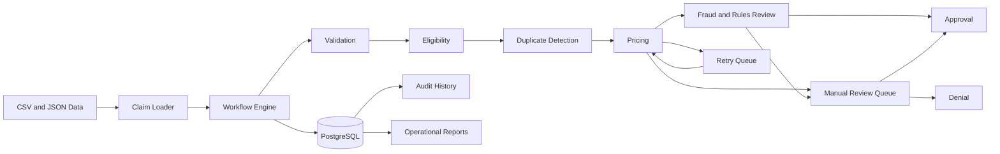

# Healthcare Claims Workflow

A Python and PostgreSQL workflow simulation that processes synthetic healthcare claims through validation, eligibility, duplicate detection, pricing, fraud and business-rule review, retry handling, manual review, approval, audit history, and operational reporting.

This project is designed as a portfolio demonstration of workflow engineering, state management, exception handling, relational data modeling, SQL reporting, and operational process design.

> All claims, members, rules, decisions, and identifiers in this repository are synthetic. This project does not contain protected health information, proprietary adjudication logic, or production healthcare data.

---

## Project Overview

The Healthcare Claims Workflow models how a claim moves through a controlled sequence of business and technical processing steps.

A valid claim can move through the complete happy path:

```text
RECEIVED
    ↓
VALIDATING
    ↓
ELIGIBILITY_CHECK
    ↓
DUPLICATE_CHECK
    ↓
PRICING
    ↓
FRAUD_REVIEW
    ↓
APPROVED
```

Claims that cannot continue automatically are routed into controlled outcomes such as:

```text
VALIDATION_FAILED
DENIED
DUPLICATE
PRICING_RETRY
MANUAL_REVIEW
FAILED
```

The system records every status transition and can answer:

```text
Where is the claim now?
Where has it been?
Why did its status change?
When did the change occur?
```

---

## Business Problem

Claims-processing workflows rarely follow only a clean happy path.

Real operational systems must handle conditions such as:

- Missing required information
- Invalid reference codes
- Inactive or expired member coverage
- Duplicate submissions
- Missing pricing configuration
- Temporary service timeouts
- Retry exhaustion
- High-risk claims
- Manual-review decisions
- Unexpected technical failures

Without explicit state management, these conditions can produce inconsistent statuses, untracked failures, repeated work, or claims that become stuck without a clear owner.

This project addresses that problem by building a workflow in which:

1. Every claim has one current state.
2. Only approved state transitions are allowed.
3. Every transition is recorded in an audit table.
4. Temporary failures can be retried.
5. Nonrecoverable exceptions can be routed to manual review.
6. One unexpected claim error does not stop the entire batch.
7. Operational reports summarize volume, outcomes, retries, and exceptions.

---

## Architecture



### Main components

| Component | Responsibility |
|---|---|
| `claim_loader.py` | Loads claims and reference data from CSV and JSON |
| `validator.py` | Validates required fields, dates, amounts, and diagnosis codes |
| `eligibility.py` | Evaluates member existence, status, and coverage dates |
| `duplicate_checker.py` | Compares member, provider, procedure, and service date |
| `pricing.py` | Assigns allowed amounts and classifies pricing failures |
| `fraud_review.py` | Applies synthetic risk and business-review rules |
| `retry_manager.py` | Defines retry limits, counts, and queue outcomes |
| `manual_review.py` | Validates and routes simulated reviewer decisions |
| `state_manager.py` | Defines legal workflow states and transitions |
| `audit_logger.py` | Writes state changes to `claim_events` |
| `error_handler.py` | Isolates unexpected claim-level failures |
| `workflow_engine.py` | Coordinates the end-to-end workflow |
| `chaos_runner.py` | Verifies intentionally problematic claim scenarios |
| `reporting.py` | Generates claim, exception, and workflow reports |
| `main.py` | Runs the application phases and prints results |

---

## Workflow

The application runs in four major phases.

### Phase 1 — Initial claim processing

```text
Claim intake
    ↓
Validation
    ↓
Eligibility
    ↓
Duplicate detection
    ↓
Pricing
    ↓
Fraud and business-rule review
```

### Phase 2 — Retry processing

Temporary pricing failures enter `retry_queue`.

```text
PRICING
    ↓
PRICING_RETRY
    ↓
Retry Queue
    ↓
PRICING
```

A retry can end in:

```text
SUCCEEDED
EXHAUSTED
CANCELLED
```

### Phase 3 — Manual review

Claims requiring human intervention enter `manual_review_queue`.

```text
MANUAL_REVIEW
      ↓
Reviewer decision
      ├── APPROVED
      └── DENIED
```

### Phase 4 — Controlled-outcome verification

Configured chaos scenarios are compared against persisted PostgreSQL results.

The verification checks:

- Final claim status
- Required state path
- Audit reasons
- Retry status
- Retry count
- Manual-review status

The run reports a failure when a scenario does not reach its expected controlled outcome.

---

## Technology Stack

| Technology | Use |
|---|---|
| Python 3.11+ | Workflow and business logic |
| PostgreSQL | Current state, queues, and audit history |
| Psycopg 3 | Python-to-PostgreSQL connectivity |
| python-dotenv | Local environment configuration |
| Pytest | Automated testing |
| CSV | Claim, member, and diagnosis data |
| JSON | Pricing rules, review rules, reviewer decisions, and scenario expectations |
| Git and GitHub | Version control and portfolio publishing |

Python 3.11 or newer is required because the project uses `StrEnum`.

---

## Project Structure

```text
healthcare-claims-workflow/
│
├── data/
│   ├── claims.csv
│   ├── members.csv
│   ├── diagnosis_codes.csv
│   ├── pricing_rules.json
│   ├── review_rules.json
│   ├── manual_review_decisions.json
│   └── chaos_scenarios.json
│
├── database/
│   ├── schema.sql
│   └── seed_data.py
│
├── logs/
│   └── .gitkeep
│
├── reports/
│   ├── claim_summary.csv
│   ├── claim_summary.json
│   ├── exception_report.json
│   ├── workflow_metrics.json
│   ├── workflow_summary.json
│   └── chaos_scenario_report.json
│
├── src/
│   ├── audit_logger.py
│   ├── chaos_runner.py
│   ├── claim_loader.py
│   ├── config.py
│   ├── database.py
│   ├── duplicate_checker.py
│   ├── eligibility.py
│   ├── error_handler.py
│   ├── fraud_review.py
│   ├── main.py
│   ├── manual_review.py
│   ├── pricing.py
│   ├── reporting.py
│   ├── retry_manager.py
│   ├── state_manager.py
│   ├── validator.py
│   └── workflow_engine.py
│
├── tests/
│   ├── conftest.py
│   ├── test_duplicate_checker.py
│   ├── test_eligibility.py
│   ├── test_happy_path.py
│   ├── test_manual_review.py
│   ├── test_pricing.py
│   ├── test_retry_manager.py
│   ├── test_state_manager.py
│   ├── test_validation.py
│   └── test_workflow_resilience.py
│
├── .env
├── .env.example
├── .gitignore
├── pytest.ini
├── README.md
└── requirements.txt
```

---

## Data Model

### `claims`

Stores the current state and core attributes of each claim.

Important columns:

| Column | Purpose |
|---|---|
| `claim_id` | Unique claim identifier |
| `member_id` | Member associated with the claim |
| `provider_id` | Provider associated with the claim |
| `diagnosis_code` | Synthetic diagnosis reference |
| `procedure_code` | Synthetic procedure reference |
| `service_date` | Date of service |
| `billed_amount` | Submitted amount |
| `allowed_amount` | Amount assigned by pricing |
| `submitted_date` | Claim submission date |
| `current_status` | Current workflow state |
| `created_at` | Claim creation timestamp |
| `updated_at` | Last state or value update |

### `claim_events`

Stores the complete audit history.

| Column | Purpose |
|---|---|
| `event_id` | Unique event identifier |
| `claim_id` | Claim associated with the event |
| `previous_status` | State before the transition |
| `new_status` | State after the transition |
| `processing_step` | Workflow component responsible |
| `event_reason` | Explanation for the change |
| `retry_attempt` | Retry number when applicable |
| `created_at` | Transition timestamp |

### `retry_queue`

Stores temporary pricing failures.

| Column | Purpose |
|---|---|
| `retry_id` | Queue record identifier |
| `claim_id` | Claim waiting for retry |
| `failed_step` | Step that failed |
| `retry_count` | Attempts already made |
| `max_retries` | Maximum automated attempts |
| `next_retry_time` | Time the retry becomes available |
| `retry_status` | Current queue outcome |
| `last_error` | Most recent retry error |

### `manual_review_queue`

Stores claims requiring reviewer intervention.

| Column | Purpose |
|---|---|
| `review_id` | Review record identifier |
| `claim_id` | Claim requiring review |
| `review_reason` | Reason automation stopped |
| `review_status` | Review outcome or current state |
| `reviewer_notes` | Simulated reviewer explanation |
| `created_at` | Queue creation time |
| `resolved_at` | Review completion time |

---

## State Transitions

The workflow does not permit arbitrary status changes.

### Primary happy path

| Current state | Allowed next state |
|---|---|
| `RECEIVED` | `VALIDATING` |
| `VALIDATING` | `ELIGIBILITY_CHECK` |
| `ELIGIBILITY_CHECK` | `DUPLICATE_CHECK` |
| `DUPLICATE_CHECK` | `PRICING` |
| `PRICING` | `FRAUD_REVIEW` |
| `FRAUD_REVIEW` | `APPROVED` |

### Exception transitions

| Current state | Possible exception state |
|---|---|
| `VALIDATING` | `VALIDATION_FAILED` |
| `ELIGIBILITY_CHECK` | `INELIGIBLE` |
| `INELIGIBLE` | `DENIED` |
| `DUPLICATE_CHECK` | `DUPLICATE` |
| `PRICING` | `PRICING_RETRY` |
| `PRICING` | `MANUAL_REVIEW` |
| `PRICING_RETRY` | `PRICING` |
| `PRICING_RETRY` | `MANUAL_REVIEW` |
| `FRAUD_REVIEW` | `MANUAL_REVIEW` |
| `MANUAL_REVIEW` | `APPROVED` |
| `MANUAL_REVIEW` | `DENIED` |

Terminal states cannot move to another state automatically.

Examples of blocked transitions:

```text
VALIDATION_FAILED → PRICING
DUPLICATE → APPROVED
APPROVED → VALIDATING
DENIED → PRICING
```

The workflow validates transitions in Python and confirms that the persisted PostgreSQL state matches the expected current state before updating it.

---

## Exception Handling

Expected business exceptions receive specific controlled outcomes.

| Condition | Controlled outcome |
|---|---|
| Missing required field | `VALIDATION_FAILED` |
| Invalid diagnosis code | `VALIDATION_FAILED` |
| Inactive member | `INELIGIBLE → DENIED` |
| Expired coverage | `INELIGIBLE → DENIED` |
| Member not found | `INELIGIBLE → DENIED` |
| Duplicate claim | `DUPLICATE` |
| Missing pricing rule | `MANUAL_REVIEW` |
| Temporary pricing timeout | `PRICING_RETRY` |
| High-risk claim | `MANUAL_REVIEW` |
| Retry exhaustion | `MANUAL_REVIEW` |
| Reviewer approval | `APPROVED` |
| Reviewer denial | `DENIED` |

Unexpected technical exceptions are isolated by claim.

```text
Claim A → APPROVED

Claim B → unexpected exception
        → controlled FAILED result
        → SYSTEM_ERROR audit attempt

Claim C → continues processing
```

A single failed claim does not terminate the rest of the batch.

---

## Retry Logic

Pricing failures are classified as either temporary or permanent.

### Temporary failure

A temporary failure may succeed without changing the claim or pricing configuration.

Example:

```text
Temporary pricing timeout
        ↓
PRICING_RETRY
        ↓
retry_queue
        ↓
Retry attempt
```

Retry records track:

- Failed step
- Current retry count
- Maximum retries
- Most recent error
- Final retry outcome

### Successful retry

```text
PRICING
    ↓
PRICING_RETRY
    ↓
PRICING
    ↓
FRAUD_REVIEW
    ↓
APPROVED
```

### Retry exhaustion

```text
PRICING
    ↓
PRICING_RETRY
    ↓
Three failed retry attempts
    ↓
MANUAL_REVIEW
```

The retry record remains `EXHAUSTED`, even after the claim receives a final reviewer decision.

This preserves the distinction between:

```text
Automated retry outcome
and
Final claim outcome
```

---

## Manual Review

Manual review represents a controlled handoff from automation to a reviewer.

Claims may enter manual review because of:

- Missing pricing configuration
- Permanent pricing failure
- High billed amount
- Configured procedure-code review
- Retry exhaustion
- Fraud or business-rule trigger

Queue progression:

```text
PENDING
    ↓
IN_REVIEW
    ↓
APPROVED or DENIED
```

Synthetic decisions are loaded from:

```text
data/manual_review_decisions.json
```

Each decision contains:

```json
{
    "claim_id": "CLM016",
    "decision": "APPROVED",
    "reviewer_notes": "Synthetic reviewer explanation."
}
```

The reviewer decision updates:

1. `claims.current_status`
2. `manual_review_queue.review_status`
3. `manual_review_queue.reviewer_notes`
4. `manual_review_queue.resolved_at`
5. `claim_events`

---

## Audit History

The `claims` table answers:

```text
Where is the claim now?
```

The `claim_events` table answers:

```text
Where has the claim been?
Why did its status change?
When did the change occur?
```

### Current claim state

```sql
SELECT
    claim_id,
    current_status,
    updated_at
FROM claims
WHERE claim_id = 'CLM015';
```

### Complete claim journey

```sql
SELECT
    event_id,
    previous_status,
    new_status,
    processing_step,
    retry_attempt,
    event_reason,
    created_at
FROM claim_events
WHERE claim_id = 'CLM015'
ORDER BY event_id;
```

### Combined journey view

```sql
SELECT
    claim_id,
    current_status,
    previous_status,
    new_status,
    processing_step,
    event_reason,
    event_created_at
FROM claim_journey
WHERE claim_id = 'CLM015'
ORDER BY event_id;
```

---

## Operational Reporting

Running the application regenerates the operational reports.

### `claim_summary.csv`

Contains one row per claim, including:

- Claim ID
- Member and provider
- Diagnosis and procedure
- Service date
- Billed amount
- Allowed amount
- Final status

### `claim_summary.json`

Contains aggregate claim volume:

- Claims received
- Claims approved
- Claims denied
- Claims rejected
- Claims currently in manual review
- Technical failures
- Automatic approvals
- Reviewer approvals

For this project:

```text
Rejected claims
=
VALIDATION_FAILED + DUPLICATE
```

Denied claims remain separate because denial represents an eligibility or reviewer decision.

### `exception_report.json`

Groups exceptions into:

- Validation failures
- Eligibility failures
- Duplicate claims
- Pricing failures
- Exhausted retries
- Manual reviews
- Unexpected system errors

Each category contains:

- Event count
- Unique affected-claim count
- Claim IDs
- Detailed records
- Reasons
- Timestamps

### `workflow_metrics.json`

Includes:

- Claims by final status
- Claims requiring retries
- Average retry count
- Retry success percentage
- Exhausted retry count
- Manual-review volume
- Reviewer approvals
- Reviewer denials
- Approval percentage
- Denial percentage
- Rejection percentage

### `workflow_summary.json`

Preserves the original concise Version 1 summary format.

### `chaos_scenario_report.json`

Shows whether every intentionally problematic scenario reached its expected controlled outcome.

---

## Running the Project Locally

### 1. Clone the repository

```bash
git clone https://github.com/buildwithmanny/healthcare-claims-workflow.git
cd healthcare-claims-workflow
```

### 2. Create a virtual environment

```bash
python3 -m venv .venv
```

Activate it on macOS or Linux:

```bash
source .venv/bin/activate
```

### 3. Install dependencies

```bash
python -m pip install --upgrade pip
python -m pip install -r requirements.txt
```

### 4. Create the PostgreSQL database

```bash
createdb claims_workflow
```

An alternative is to use PostgreSQL directly:

```bash
psql -U postgres
```

```sql
CREATE DATABASE claims_workflow;
\q
```

### 5. Apply the database schema

```bash
psql -U postgres -d claims_workflow -f database/schema.sql
```

### 6. Configure environment variables

```bash
cp .env.example .env
```

Update `.env` with the local PostgreSQL password.

### 7. Run the application

```bash
python -m src.main
```

The application will:

1. Load synthetic source data.
2. Reset the local demonstration tables.
3. Process initial claims.
4. Process retry records.
5. Process manual-review decisions.
6. Verify chaos scenarios.
7. Generate operational reports.

---

## Environment Variable Setup

The local `.env` file should contain:

```dotenv
DB_HOST=localhost
DB_PORT=5432
DB_NAME=claims_workflow
DB_USER=postgres
DB_PASSWORD=your_actual_local_password
```

The `.env` file contains local credentials and must not be committed.

Confirm Git ignores it:

```bash
git check-ignore -v .env
```

Confirm it is not tracked:

```bash
git ls-files .env
```

The second command should return no output.

The repository includes `.env.example` as a safe configuration template:

```dotenv
DB_HOST=localhost
DB_PORT=5432
DB_NAME=claims_workflow
DB_USER=postgres
DB_PASSWORD=
```

---

## Testing

The automated test suite covers:

- Valid claim processing
- Missing member ID
- Invalid diagnosis code
- Active eligibility
- Expired eligibility
- Unknown member
- Duplicate detection
- Unique claim routing
- Pricing success
- Missing pricing rule
- Pricing timeout
- Retry success
- Retry exhaustion
- Manual-review approval
- Manual-review denial
- Valid state transitions
- Invalid state transitions
- Terminal-state protection
- Claim-level failure isolation

Run the full test suite through the active virtual environment:

```bash
python -m pytest -v
```

Using `python -m pytest` ensures that pytest runs through the same Python interpreter as the virtual environment.

The project includes:

```ini
pythonpath = .
```

inside `pytest.ini`, allowing tests to import modules using:

```python
from src.pricing import evaluate_pricing
```

Run one test file:

```bash
python -m pytest tests/test_state_manager.py -v
```

Run the claim-isolation test:

```bash
python -m pytest tests/test_workflow_resilience.py -v
```

---

## Example Outputs

With the current 18-claim synthetic dataset, the expected final status totals are:

```text
APPROVED: 7
DENIED: 5
DUPLICATE: 1
VALIDATION_FAILED: 5
```

Expected aggregate metrics:

```text
Claims received: 18
Claims approved: 7
Claims denied: 5
Claims rejected: 6
Claims currently in manual review: 0

Claims requiring retries: 2
Average retry count: 2.00
Successful retries: 1
Exhausted retries: 1

Manual-review volume: 4
Reviewer approvals: 2
Reviewer denials: 2

Approval percentage: 38.89%
Denial percentage: 27.78%
Rejection percentage: 33.33%
```

Expected retry outcomes:

```text
CLM015
Retry status: SUCCEEDED
Retry count: 1
Final claim status: APPROVED
```

```text
CLM017
Retry status: EXHAUSTED
Retry count: 3
Manual-review status: DENIED
Final claim status: DENIED
```

Expected chaos verification:

```text
Controlled scenarios: 11 of 11
```

---

## Example PostgreSQL Queries

### Claims by final status

```sql
SELECT
    current_status,
    COUNT(*) AS claim_count
FROM claims
GROUP BY current_status
ORDER BY current_status;
```

### Retry metrics

```sql
SELECT
    COUNT(DISTINCT claim_id) AS claims_requiring_retries,
    AVG(retry_count) AS average_retry_count,
    COUNT(*) FILTER (
        WHERE retry_status = 'SUCCEEDED'
    ) AS successful_retries,
    COUNT(*) FILTER (
        WHERE retry_status = 'EXHAUSTED'
    ) AS exhausted_retries
FROM retry_queue;
```

### Manual-review volume

```sql
SELECT
    COUNT(*) AS manual_review_volume,
    COUNT(*) FILTER (
        WHERE review_status = 'APPROVED'
    ) AS reviewer_approvals,
    COUNT(*) FILTER (
        WHERE review_status = 'DENIED'
    ) AS reviewer_denials
FROM manual_review_queue;
```

### Pricing failures

```sql
SELECT
    claim_id,
    previous_status,
    new_status,
    retry_attempt,
    event_reason,
    created_at
FROM claim_events
WHERE processing_step IN (
    'PRICING',
    'PRICING_RETRY'
)
  AND new_status IN (
      'PRICING_RETRY',
      'MANUAL_REVIEW',
      'FAILED'
  )
ORDER BY claim_id, event_id;
```

---

## Lessons Learned

### Workflow design requires explicit states

A workflow becomes easier to reason about when every claim has one current status and each transition is explicitly allowed or rejected.

### Current state and history serve different purposes

The `claims` table provides the latest operational position. The `claim_events` table preserves the complete journey.

Both are required for reliable troubleshooting.

### Temporary and permanent failures should not be handled the same way

A timeout may succeed later and belongs in a retry queue. Missing pricing configuration will not be fixed by repeating the same operation and requires intervention.

### Retry exhaustion is not necessarily the final business outcome

The automated retry process can end in `EXHAUSTED`, while a reviewer later makes the final claim decision.

### Manual review is a workflow, not just a status

A useful manual-review design requires a queue, reason, status, reviewer notes, decision, and resolution timestamp.

### Error isolation improves operational resilience

One unexpected claim failure should not prevent unrelated claims from completing processing.

### Audit reasons matter as much as audit statuses

A status history without explanations cannot answer why a claim changed. Each event therefore includes a processing step, reason, and timestamp.

### Operational reporting should distinguish counts from events

One claim can produce several pricing-failure events across multiple retries. Reports distinguish:

```text
Event count
from
Unique affected-claim count
```

### Controlled failure is a successful system behavior

The goal is not for every claim to be approved. The goal is for every claim to reach a predictable, explainable, and auditable outcome.

---

## Portfolio Summary

This project demonstrates the ability to:

- Translate a business workflow into explicit technical states
- Build Python processing modules with separate responsibilities
- Model operational data in PostgreSQL
- Validate legal and illegal state transitions
- Create complete audit history
- Distinguish temporary and permanent failures
- Implement bounded retry handling
- Build manual-review routing
- Isolate claim-level technical errors
- Create automated tests
- Verify controlled failure scenarios
- Generate operational reports and metrics

A concise project description:

> Built a stateful healthcare claims workflow using Python and PostgreSQL. The system validates claims, verifies eligibility, detects duplicates, assigns synthetic pricing, handles bounded retries, routes exceptions to manual review, records complete audit history, isolates claim-level failures, verifies controlled chaos scenarios, and generates operational reports.